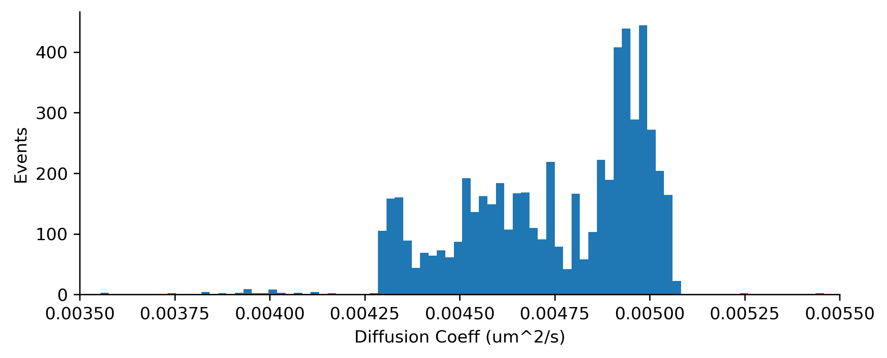
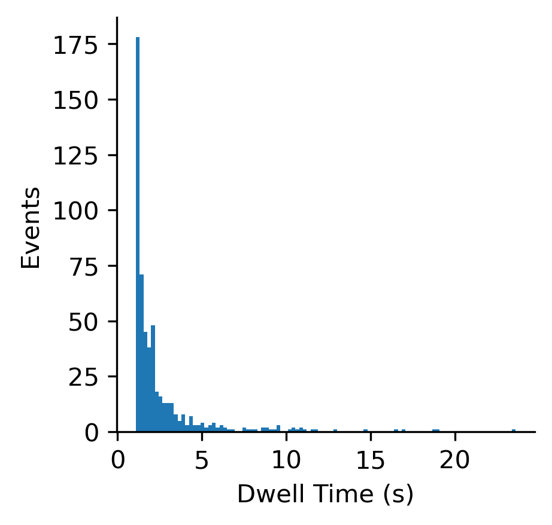

# swe4s-spt
SWE4S: Single Particle Tracking

**Project goal:** develop a Python-based pipeline to process single molecule movies, generate particle trajectories, and calculate properties such as diffusion coefficients and dwell times.

**Inputs**
TIF or ND2 (proprietary from NIS-Elements) movie with fluorescently labeled proteins of interest.

**Outputs**
* feature overlay movie (extracted features are drawn to frames)
* processed movie
* particle trajectories
* diffusion coefficients & particle dwell times 

## Requirements
Note - this was developed using Python 3.8.5
All Python package requirements are listed in the file `requirements.txt`. Install can be achieved using
```
pip install -r requirements.txt
```


## Usage
### Image processing
**A note about ND2 Files:**

If a user would like to analyze a ND2 file from Nikon Elements, it first must be converted to a TIF file using the script `convert_ND_to_TIF.py`. Usage of this is script is as follows:
``` python convert_ND2_to_TIF.py --file sample_SPT.nd2
```
The output of this will be a TIF stack of the same size (X, Y, Z, T) and same name, but with the `.tif` file extension

**Feature detection:**

Features (particles) are detected and extracted using the OpenCV python package. 
> Needs to be expanded on a bit more - how do we run this?

**Track Linking:**

> Needs to be expanded a bit more - how do we run this?

### Data Processing and Analysis

Once tracks are linked, users can analyze the resulting particle trajectories. We have provided two Python scripts, `get_diffusion.py` and `get_dwelltime.py` for calculating particle diffusion coefficients and particle dwell times, respectively. Usage of these scripts is as follows:
```
python get_diffusion.py --file sample_SPT_tracks.csv --delta_T 0.1 
```
where `--file` coresponds to the CSV containing the X and Y coordinates for each particle, and `--delta_T` is the time delay between frames, in seconds.

``` 
python get_dwelltime.py --file sample_SPT_tracks.csv --delta_T 0.1 --bound_frames 10 --max_disp 200
```
where `--file` coresponds to the CSV containing the X and Y coordinates for each particle;  `--delta_T` is the time delay between frames, in seconds; `bound_frames` is the minimum number of frames a particle can be stationary to be considered bound; and `max_disp` is the maximum displacement, in nanometers, that a particle can move during its bound state.

Each will return a CSV file containing the trajectory ID and its diffusion coefficient or dwell time. 

**Data Plotting**
We have provided two scripts to faciltate plotting of particle diffusion coefficients and dwell times - `plot_diffusion.py` and `plot_dwelltime.py`.  These will return PNG files containing histograms of the data. 






**Updates**

*Week of 12/6/2020 (final updates):*
- updated README with more thorough documentation
- generated requirements file
- track linking 

*Week of 11/23/2020:*
 - generated function for calculating particle dwell time, and for getting particle xy coordinates
 - updated testing to be more robust
 - wrote scripts to plot diffusion and dwell time data
 
 *11/09/2020:*
- improved documentation and imports using guidance from project review and removed unused variables in the cv functions

*11/07/2020:*
- fixed testing for process_image by adding a directory creation for out/ and re-developed process_frame output file as a tif stack instead of multiple .pngs

*11/06/2020:*
- fixed process_image function so that it uses pims library to handle stacked tifs

*11/04/2020:*
 - created process_image function that will open a file as a numpy array and then process that file using opencv

*11/03/2020:*
 - generated code to convert ND2 to a TIF, for simplicity. Scaling looks to be a bit off compared to the original ND2, but for now it should suffice.
  
 
